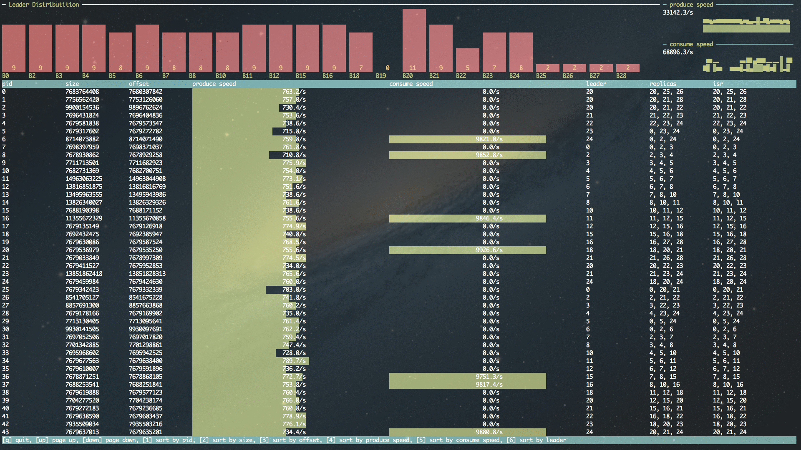

# KOTop - Kafka Offset Top

Get a glimpse of Kafka topic and consumer status

## Main Features

- Partition leader distribution
- Topic size, leader, replicas, isr
- Speed of consumer and topic size increment
- sort by each field

## Installation

	go get -u github.com/simon-xia/kotop

## Usage

    kotop -broker "192.168.0.1:9092,192.168.0.2:9092,192.168.0.3:9092" -zk "192.168.0.1:2181,192.168.0.2:2181/kafka_root_dir" -topic mytopic -group my_consumer_group

 Or you can use config file

    simonxia:~$cat kotop.conf
    {
            "brokers":"192.168.0.1:9092,192.168.0.2:9092,192.168.0.3:9092",
            "zkhosts":"192.168.0.1:2181,192.168.0.2:2181/kafka_root_dir"
    }

  then

    kotop -f kotop.conf -topic mytopic -group my_consumer_group